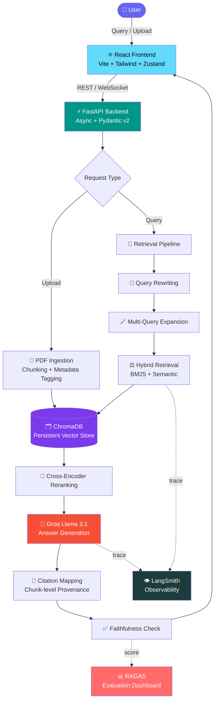
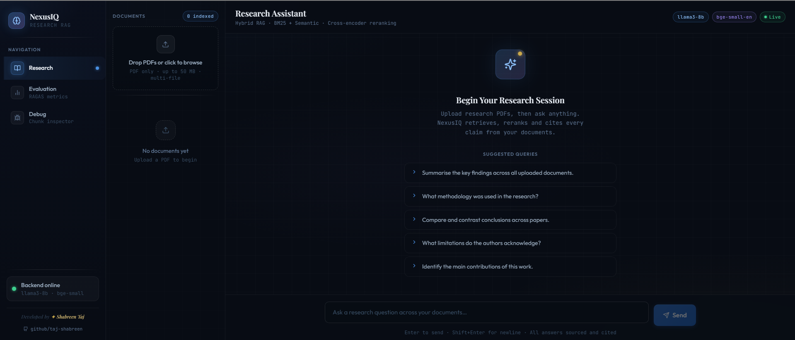
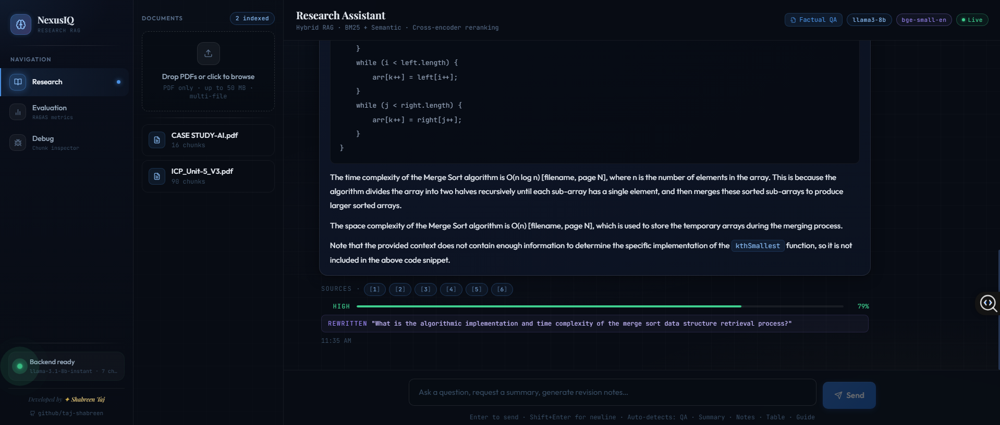
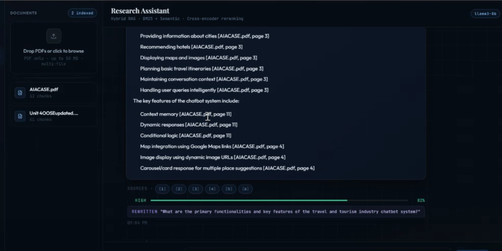
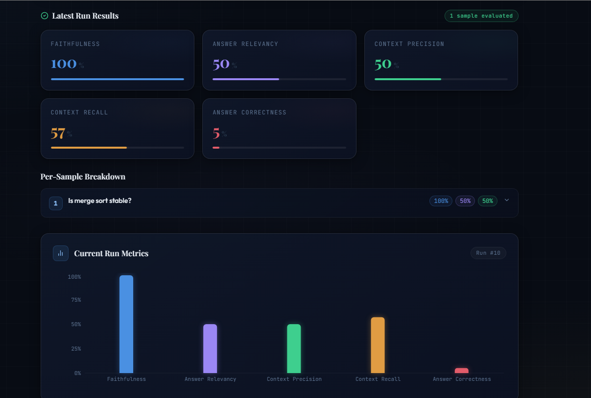
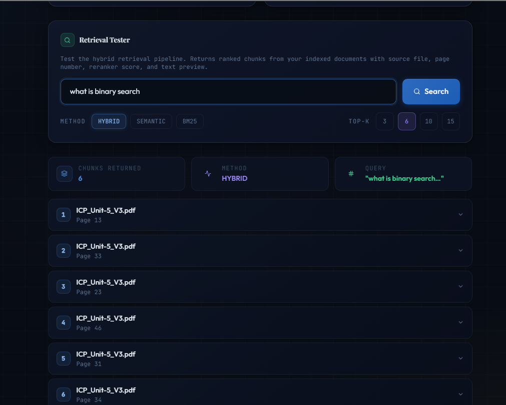
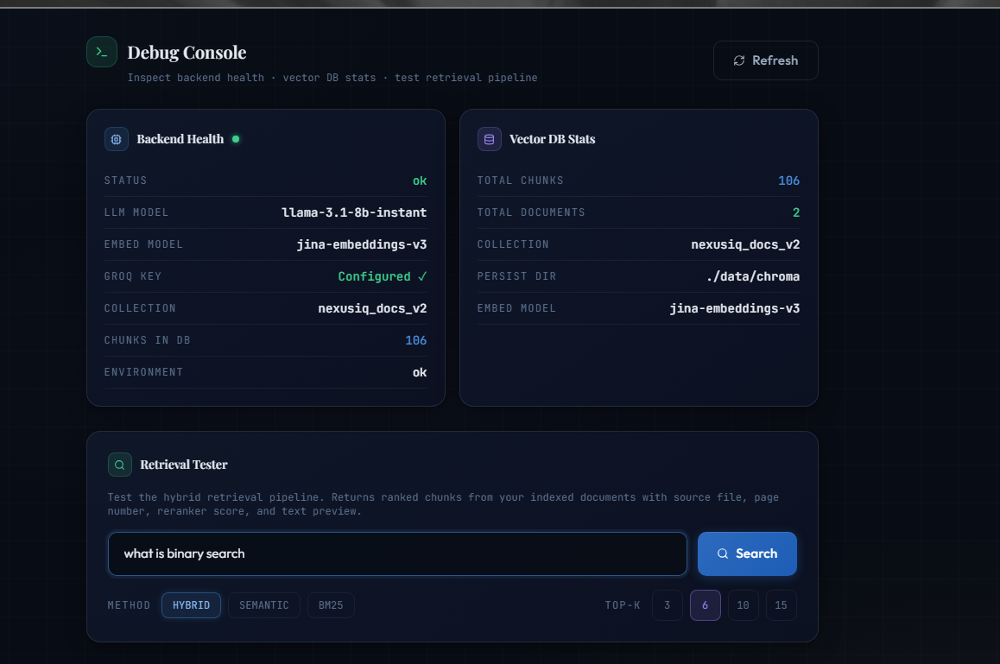

<div align="center">

# 🧠 NexusIQ

### Advanced Multi-Document Research RAG Assistant

**Production-grade conversational RAG system with hybrid retrieval, citation-aware answers, hallucination detection, and RAGAS-powered evaluation.**

*Ask questions across dozens of documents. Get cited, explainable, hallucination-checked answers — in seconds.*

<br/>

[](https://fastapi.tiangolo.com/)
[](https://react.dev/)
[](https://groq.com/)
[](https://www.trychroma.com/)
[](https://github.com/explodinggradients/ragas)

<br/>

[](LICENSE)
[](../../pulls)
[](https://www.python.org/)
[](https://nodejs.org/)
[](https://www.langchain.com/)
[](https://smith.langchain.com/)

<br/>

[**Live Demo**](#) · [**Documentation**](#-table-of-contents) · [**Report Bug**](../../issues) · [**Request Feature**](../../issues)

</div>

<br/>

---

## 📋 Table of Contents

- [Overview](#-overview)
- [Key Features](#-key-features)
- [System Architecture](#-system-architecture)
- [Tech Stack](#-tech-stack)
- [Project Structure](#-project-structure)
- [Screenshots](#-screenshots)
- [Installation](#-installation)
- [Example Workflow](#-example-workflow)
- [Evaluation Framework](#-evaluation-framework)
- [Future Improvements](#-future-improvements)
- [Contributing](#-contributing)
- [Author](#-author)

---

## 🎯 Overview

Large Language Models are fluent — but they are not inherently *truthful*. Left on their own, they hallucinate facts, lose track of source documents, and provide no way to verify *why* an answer was given. For research, legal, academic, and enterprise use cases, this is a dealbreaker.

**Retrieval-Augmented Generation (RAG)** solves this by grounding LLM responses in real, retrievable evidence — but most RAG tutorials stop at "embed and retrieve." Production-grade RAG requires far more: hybrid retrieval to catch what pure semantic search misses, reranking to surface the *most relevant* evidence, query rewriting to handle ambiguous questions, and rigorous evaluation to measure faithfulness before users ever see an answer.

**NexusIQ** is built to close that gap. It's a full-stack, multi-document research assistant that lets users upload entire collections of PDFs and have grounded, cited, explainable conversations with them — backed by a retrieval pipeline and evaluation framework designed the way production RAG systems actually need to work.

> 💡 **Why this project matters:** It demonstrates the full RAG lifecycle — ingestion, hybrid retrieval, reranking, generation, citation, and evaluation — in a real, deployable, end-to-end system. Not a notebook. Not a toy demo. A product.

---

## ✨ Key Features

<table>
<tr>
<td width="50%" valign="top">

### 📄 Ingestion & Indexing
- **Multi-document PDF ingestion** with intelligent, recursive chunking
- Persistent vector storage via **ChromaDB**
- Metadata-aware chunking preserving page & source provenance

### 🔍 Retrieval Intelligence
- **Hybrid retrieval** combining BM25 (lexical) + semantic (dense vector) search
- **Multi-query retrieval** — generates multiple query variations to widen recall
- **Query rewriting** for ambiguous or conversational follow-up questions
- **Cross-encoder reranking** to reorder candidates by true relevance

</td>
<td width="50%" valign="top">

### 💬 Generation & Trust
- **Citation-aware answers** with chunk-level source provenance
- **Explainable retrieval** — see exactly which chunks informed each answer
- **Hallucination reduction** via grounded prompting + faithfulness checks
- Conversational, multi-turn context handling

### 📊 Evaluation & Ops
- **RAGAS evaluation dashboard** scoring faithfulness & relevancy
- **Retrieval debugger** for raw chunk inspection
- **LangSmith observability** with full trace logging
- **Production deployment** configs for Render + Vercel

</td>
</tr>
</table>

---

## 🏗️ System Architecture

NexusIQ follows a clean, modular pipeline — each stage is independently observable, testable, and swappable.



**Pipeline summary:** `User → React Frontend → FastAPI Backend → Retrieval Pipeline (Rewrite → Multi-Query → Hybrid Search → Rerank) → ChromaDB → Groq LLM → Cited Answer Generation`

---

## 🛠️ Tech Stack

| Layer | Technology |
|---|---|
| **Frontend** | React + Vite + TailwindCSS + Zustand + Framer Motion |
| **Backend** | FastAPI (async) + Pydantic v2 |
| **LLM** | Groq — Llama 3.1 (`llama-3.1-8b-instant`) |
| **Embeddings** | Sentence Transformers — `BAAI/bge-small-en` |
| **Vector Store** | ChromaDB (persistent, on-disk) |
| **Retrieval** | BM25 + Semantic Search + Cross-Encoder Reranking |
| **Orchestration** | LangChain |
| **Evaluation** | RAGAS (Faithfulness, Relevancy, Precision, Recall) |
| **Observability** | LangSmith (full trace logging) |
| **Deployment** | Render (backend) + Vercel (frontend) |

---

## 📁 Project Structure

```
nexusiq/
├── backend/
│   ├── app/
│   │   ├── api/
│   │   │   ├── __init__.py
│   │   │   ├── debug.py             # Retrieval debugger endpoints
│   │   │   ├── documents.py         # Document upload & management
│   │   │   ├── evaluation.py        # RAGAS evaluation endpoints
│   │   │   ├── query.py             # RAG query endpoints
│   │   │   └── visitors.py          # Visitor session handling
│   │   ├── evaluation/
│   │   │   ├── __init__.py
│   │   │   └── ragas_eval.py        # RAGAS scoring pipeline
│   │   ├── observability/
│   │   │   ├── __init__.py
│   │   │   └── langsmith_tracer.py  # LangSmith trace logging
│   │   ├── rag/
│   │   │   ├── __init__.py
│   │   │   ├── embeddings.py        # Sentence Transformers embedding logic
│   │   │   ├── ingestion.py         # PDF parsing & chunking
│   │   │   ├── pipeline.py          # End-to-end RAG orchestration
│   │   │   ├── retriever.py         # Hybrid retrieval + reranking
│   │   │   └── vectorstore.py       # ChromaDB client & operations
│   │   ├── utils/
│   │   │   └── __init__.py
│   │   ├── config.py                # Settings & environment config
│   │   └── main.py                  # FastAPI app entrypoint
│   ├── data/
│   │   ├── chroma/                  # Persistent vector store
│   │   ├── model_cache/             # Cached embedding/reranker models
│   │   ├── uploads/                 # Raw uploaded PDFs
│   │   └── eval_history.jsonl       # Logged RAGAS evaluation runs
│   ├── .env
│   └── requirements.txt
│
├── frontend/
│   ├── node_modules/
│   ├── src/
│   │   ├── components/
│   │   │   ├── ChatWindow.jsx       # Main conversational interface
│   │   │   ├── CitationBadge.jsx    # Inline source citation tags
│   │   │   ├── ConfidenceMeter.jsx  # Visual faithfulness/confidence score
│   │   │   ├── DocumentUpload.jsx   # PDF upload UI
│   │   │   └── Layout.jsx           # Shared app shell/layout
│   │   ├── hooks/
│   │   │   └── useDocuments.js      # Document state & fetch hook
│   │   ├── pages/
│   │   │   ├── DebugPage.jsx        # Retrieval debugger view
│   │   │   ├── EvaluationPage.jsx   # RAGAS evaluation dashboard
│   │   │   ├── ResearchPage.jsx     # Main research/chat page
│   │   │   └── VisitorModal.jsx     # Visitor session modal
│   │   ├── services/
│   │   │   └── api.js               # Axios/fetch API client
│   │   ├── store/
│   │   │   ├── chatStore.js         # Zustand chat state
│   │   │   └── documentStore.js     # Zustand document state
│   │   ├── App.jsx
│   │   ├── index.css
│   │   └── main.jsx
│   ├── index.html
│   ├── package.json
│   ├── package-lock.json
│   ├── postcss.config.js
│   ├── tailwind.config.js
│   └── vite.config.js
│
├── screenshots/
│   ├── 1.png                        # Dashboard
│   ├── 2.png                        # Document Upload
│   ├── 3.png                        # Research Assistant
│   ├── 4.png                        # Evaluation Analytics
│   └── 5.png                        # Retrieval Debugger
│
├── .gitignore
├── README.md
├── render.yaml                      # Render deployment config
└── setup.py
```

---

## 📸 Screenshots

<div align="center">

### Dashboard


<br/><br/>

### Document Upload


<br/><br/>

### Research Assistant


<br/><br/>

### Evaluation Analytics


<br/><br/>

<br/><br/>

### Retrieval Debugger


### Retrieval Debugger


</div>

---

## ⚙️ Installation

### Prerequisites

- Python 3.10+
- Node.js 18+
- A free [Groq API key](https://console.groq.com/)

### Backend Setup

```bash
cd backend

# Create and activate virtual environment
python -m venv .venv
source .venv/bin/activate        # Windows: .venv\Scripts\activate

# Install dependencies
pip install -r requirements.txt

# Configure environment
# Create a .env file in backend/ — see Environment Variables section below

# Run the API
uvicorn app.main:app --reload --port 8000
```

Backend will be live at **http://localhost:8000** — interactive API docs at **http://localhost:8000/docs**

### Frontend Setup

```bash
cd frontend

# Install dependencies
npm install

# Run dev server
npm run dev
```

Frontend will be live at **http://localhost:5173**

### Environment Variables

Create a `.env` file inside `backend/` with the following:

```env
# LLM Provider
GROQ_API_KEY=your_groq_api_key_here
GROQ_MODEL=llama-3.1-8b-instant

# Embeddings
EMBEDDING_MODEL=BAAI/bge-small-en

# Vector Store
CHROMA_PERSIST_DIR=./data/chroma

# Retrieval Config
HYBRID_ALPHA=0.5
RERANK_TOP_K=5
RETRIEVAL_TOP_K=20

# Observability (optional)
LANGCHAIN_TRACING_V2=true
LANGCHAIN_API_KEY=your_langsmith_api_key
LANGCHAIN_PROJECT=nexusiq

# CORS
ALLOWED_ORIGINS=http://localhost:5173
```


## 🔄 Example Workflow

```
1. 📤 Upload PDFs       → Drag & drop one or more research documents
2. 🗂️  Index Documents   → Documents are chunked, embedded & stored in ChromaDB
3. 💬 Ask a Question     → Natural language query submitted via chat interface
4. 🔍 Retrieve Evidence  → Hybrid retrieval + reranking surfaces top relevant chunks
5. 📌 Generate Answer    → Groq Llama 3.1 generates a grounded, cited response
6. ✅ Verify & Explore   → Inspect citations, source chunks & faithfulness scores
```

---

## 📊 Evaluation Framework

NexusIQ integrates **RAGAS** (Retrieval-Augmented Generation Assessment) to quantitatively measure answer quality — because "it looks right" isn't good enough for production systems.

| Metric | What It Measures |
|---|---|
| **Faithfulness** | Does the generated answer stay factually grounded in the retrieved context, or does it hallucinate beyond what the evidence supports? |
| **Answer Relevancy** | Does the answer actually address the user's question, avoiding irrelevant or off-topic content? |
| **Context Precision** | Of the retrieved chunks, how many are actually relevant to answering the query? Measures retrieval noise. |
| **Context Recall** | Did the retrieval pipeline successfully surface *all* the relevant information needed to fully answer the query? |

These scores are computed per-query and aggregated into the **Evaluation Analytics Dashboard**, giving visibility into where the pipeline excels and where retrieval or generation may need tuning — closing the loop between *building* RAG and *trusting* RAG.

---

## 🔮 Future Improvements

- [ ] **Agentic RAG** — multi-step reasoning agents that decide when and how to retrieve
- [ ] **Knowledge Graph RAG** — entity & relationship-aware retrieval over structured graphs
- [ ] **Multi-modal RAG** — support for images, tables, and charts within documents
- [ ] **OCR Integration** — ingest scanned PDFs and image-based documents
- [ ] **Streaming Responses** — token-by-token streaming for real-time answer generation
- [ ] **Fine-tuned Rerankers** — domain-specific cross-encoder fine-tuning for higher precision

---

## 🤝 Contributing

Contributions, issues, and feature requests are welcome! Feel free to check the [issues page](../../issues).

1. Fork the project
2. Create your feature branch (`git checkout -b feature/amazing-feature`)
3. Commit your changes (`git commit -m 'Add some amazing feature'`)
4. Push to the branch (`git push origin feature/amazing-feature`)
5. Open a Pull Request

---

## 👤 Author

<div align="center">


<br/>

[](https://github.com/taj-shabreen)
[](https://github.com/taj-shabreen)

<br/>


<br/><br/>


<br/><br/>


</div>

---

<div align="center">

### ⭐ If you find this project useful, consider giving it a star!

*Built with a focus on production-grade RAG engineering — not just a prototype.*

<br/>

</div>
