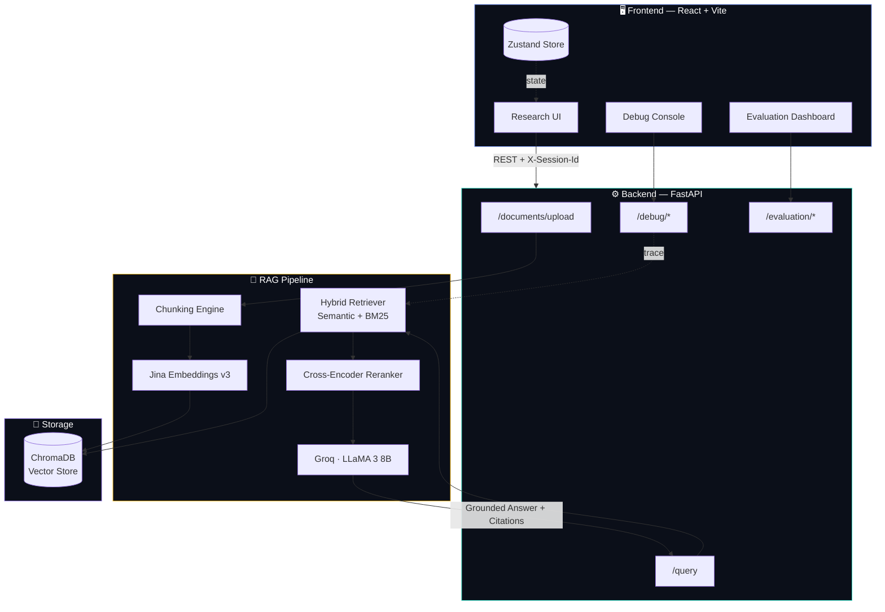
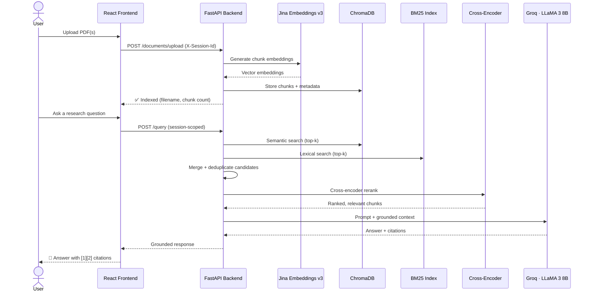
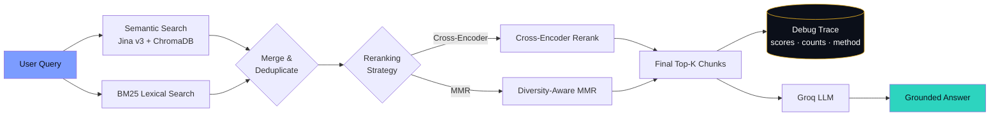
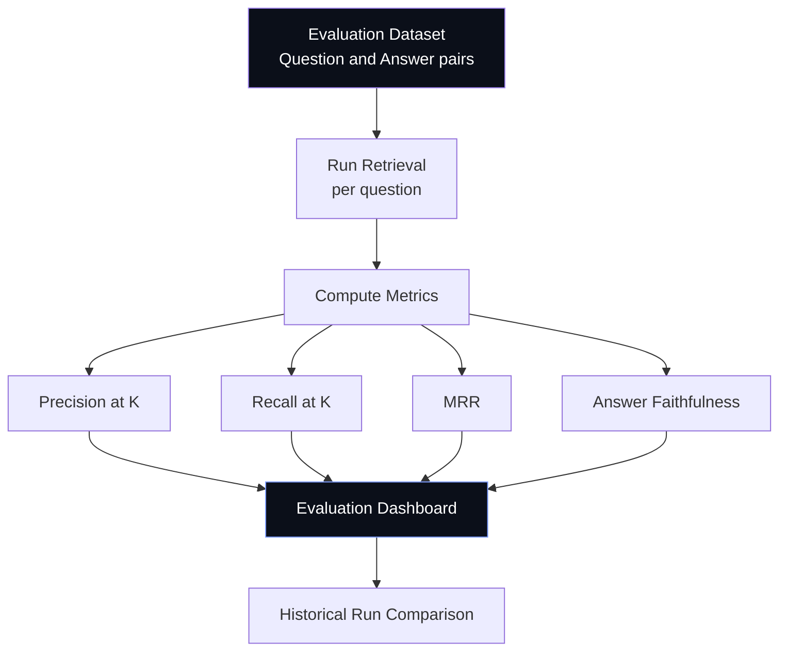

<div align="center">



<br/><br/>

<p>
<a href="https://nexus-iq-research-assistant.vercel.app/"></a>
<a href="https://github.com/taj-shabreen/nexusiq"></a>
<a href="https://pshabreentaj.com"></a>
</p>

<br/>

<!-- Production status badges -->
<p>


</p>

</div>

<br/>

<!-- Tech stack — grouped by category, aligned badge style -->
<div align="center">

**Backend & AI**
<br/>


<br/><br/>

**Frontend**
<br/>


<br/><br/>

**Deployment**
<br/>


</div>

<br/>

<div align="center">
  
</div>

<br/>

## 🧠 What is NexusIQ?

> **NexusIQ** is a production-grade AI research assistant that lets you upload multiple PDFs, run **hybrid retrieval** (semantic + BM25 + cross-encoder reranking), and get **grounded, citation-backed answers** — with a full **evaluation dashboard** and **retrieval debug console** so you can see exactly *why* the model said what it said.

This isn't a weekend RAG demo. It's a session-isolated, multi-document, fully observable retrieval pipeline — built the way a real AI product team would build it.

<br/>

<table align="center" width="100%">
<tr>
<td align="center" width="25%">
<h3>📄</h3>
<b>Multi-PDF Upload</b>
<br/>
<sub>Drag, drop, index — instantly</sub>
</td>
<td align="center" width="25%">
<h3>🔍</h3>
<b>Hybrid Retrieval</b>
<br/>
<sub>Semantic + BM25 + Reranking</sub>
</td>
<td align="center" width="25%">
<h3>💬</h3>
<b>Grounded Q&A</b>
<br/>
<sub>Citations, not hallucinations</sub>
</td>
<td align="center" width="25%">
<h3>🧪</h3>
<b>Debug Console</b>
<br/>
<sub>Inspect every retrieved chunk</sub>
</td>
</tr>
</table>

<br/>

<div align="center">
  
</div>

<br/>

## 🎯 Why NexusIQ?

Most RAG tutorials stop at "embed your PDF, ask a question." That's a notebook, not a product. The real problems show up the moment more than one person uses the system, more than one document is uploaded, or someone asks *"why did it say that?"*

NexusIQ exists to answer the questions a toy RAG project never has to face:

<table>
<tr>
<td width="50%" valign="top">

**The problem with naive RAG**
- One global vector collection → users see each other's documents
- Pure semantic search → misses exact keyword matches (model names, IDs, acronyms)
- No visibility into retrieval → "the answer is wrong" with no way to debug *why*
- No way to measure if retrieval quality improved or regressed between changes
- Cold-start failures on serverless deployments with no graceful handling

</td>
<td width="50%" valign="top">

**What NexusIQ does instead**
- Every request is scoped by `X-Session-Id` — hard document isolation per browser session
- Hybrid retrieval fuses semantic + BM25, so both meaning and exact terms are covered
- A dedicated Debug Console exposes every chunk, score, and method used per query
- An Evaluation Dashboard tracks Precision@K, Recall@K, MRR, and faithfulness over time
- A `/ready` readiness gate with polling and backoff handles slow cold starts gracefully

</td>
</tr>
</table>

<br/>

## 🏭 Production Features

This section exists because "production-ready" is a claim that should be backed by specifics, not adjectives.

| Capability | Toy RAG Project | NexusIQ |
|:---|:---|:---|
| Document storage | One shared collection | Session-isolated, per-user ChromaDB partitioning |
| Retrieval | Semantic search only | Hybrid: semantic + BM25 + cross-encoder reranking |
| Observability | None — answers are a black box | Dedicated Debug Console with full retrieval trace |
| Quality measurement | "It looks right" | Evaluation Dashboard with Precision@K, Recall@K, MRR |
| Error handling | Unhandled exceptions | Typed error responses, retry logic, readiness polling |
| Deployment | `localhost` only | Vercel (frontend) + Render (backend), live in production |
| API design | Ad-hoc endpoints | Versioned REST API with session headers and timeouts |
| Upload reliability | Single attempt | Retry with exponential backoff on transient failures |

<br/>

## 🛠️ Real Engineering Challenges Solved

<details open>
<summary><b>🔒 Session Isolation — Multi-Tenant Document Privacy Without User Accounts</b></summary>
<br/>

**The problem:** Without authentication, how do you stop User A's uploaded PDFs from appearing in User B's search results?

**The solution:** Every request — uploads, queries, debug calls — carries an `X-Session-Id` header generated client-side (`crypto.randomUUID()`, persisted in `localStorage`). The backend filters every ChromaDB query with `where={"session_id": session_id}`, so retrieval is partitioned at the database query level, not just in the UI. No session ID, no document access — enforced server-side, not trusted from the client.

</details>

<details>
<summary><b>🔀 Hybrid Retrieval — Why Semantic Search Alone Isn't Enough</b></summary>
<br/>

**The problem:** Pure embedding search is excellent at *meaning* but weak at *exact terms* — model names, version numbers, acronyms, and rare proper nouns often don't embed distinctly enough to rank highly.

**The solution:** Every query runs through two independent retrievers — Jina v3 semantic search against ChromaDB, and a BM25 lexical index — in parallel. Results are merged and deduplicated, then passed through a cross-encoder reranker (with an MMR diversity-aware mode as an alternative strategy) to produce the final top-K. The Debug Console exposes the count and scores from each branch, so retrieval behavior is inspectable, not assumed.

</details>

<details>
<summary><b>🧪 Debug Console — Making a Black-Box Pipeline Observable</b></summary>
<br/>

**The problem:** When a RAG system gives a bad answer, the default debugging experience is re-reading the prompt and guessing.

**The solution:** A dedicated console exposing three views: a health panel (LLM, embedding, and vector DB connectivity), a stats panel (chunks indexed, documents stored), and a retrieval tester that runs any query through the live pipeline and returns the exact ranked chunks, scores, filenames, and page numbers the LLM was given — the same trace object the production query path generates.

</details>

<details>
<summary><b>📊 Evaluation Pipeline — Measuring Retrieval Quality, Not Guessing at It</b></summary>
<br/>

**The problem:** "I tweaked the chunking strategy, did retrieval get better or worse?" is unanswerable without a benchmark.

**The solution:** A labeled Q&A evaluation set is run through the live retrieval pipeline, and Precision@K, Recall@K, MRR, and answer faithfulness are computed and stored per run, so changes to chunking, embeddings, or reranking can be compared against a previous baseline instead of eyeballed.

</details>

<details>
<summary><b>☁️ Deployment Issues Solved — Cold Starts, CORS, and Split Hosting</b></summary>
<br/>

**The problem:** Frontend on Vercel, backend on Render, free-tier cold starts that can take 30–60 seconds, and a vector DB that needs to persist across restarts.

**The solution:** A `/ready` endpoint the frontend polls with exponential backoff before allowing uploads, explicit CORS configuration for the cross-origin split-hosting setup, a persistent disk-backed ChromaDB directory on Render so the index survives redeploys, and typed client-side error mapping (503 vs. timeout vs. network failure) so users see "backend is still starting" instead of a generic failure.

</details>

<br/>

## 📈 Performance & Scale

<div align="center">

| Metric | Value |
|:---|:---|
| Chunks indexed (sample corpus) | **106+** chunks across multiple PDFs |
| Embedding model | Jina Embeddings v3 (API-based, no local model weights to manage) |
| Retrieval strategy | Hybrid — semantic (ChromaDB) + lexical (BM25), merged and deduplicated |
| Reranking | Cross-encoder reranking, with MMR as a diversity-aware alternative |
| LLM inference | Groq API — LLaMA 3 8B, 8192-token context |
| Deployment | Live in production — Vercel (frontend) + Render (backend) |
| Session isolation | Enforced at the database query layer via `X-Session-Id` |

</div>

<br/>

## 🧭 Engineering Decisions

Every dependency here was a deliberate tradeoff, not a default.

<details>
<summary><b>Why Jina Embeddings v3 over a local sentence-transformer model?</b></summary>
<br/>

A self-hosted embedding model means managing GPU/CPU inference, model weight downloads, and cold-start latency on every deploy. Jina v3 is API-based — no model loading at startup, consistent embedding quality across restarts, and one less piece of infrastructure to operate on a free-tier backend host.

</details>

<details>
<summary><b>Why ChromaDB over Pinecone, Weaviate, or pgvector?</b></summary>
<br/>

ChromaDB runs embedded — no separate database service to provision or pay for — while still supporting metadata filtering (`where={"session_id": ...}`), which is exactly what session isolation needs. For a single-instance deployment on Render with a persistent disk, it's the right complexity-to-capability ratio; a managed vector DB would be over-engineering at this scale.

</details>

<details>
<summary><b>Why Groq over OpenAI or Anthropic for inference?</b></summary>
<br/>

Groq's LPU inference is dramatically faster at low latency for an 8B-class model, which matters directly for perceived responsiveness in a chat-style research UI. LLaMA 3 8B's 8192-token context is sufficient for grounded RAG answers where the retrieved chunks — not the model's parametric knowledge — carry the weight.

</details>

<details>
<summary><b>Why FastAPI over Flask or Django?</b></summary>
<br/>

Native async support matters when a single query fans out to embedding calls, ChromaDB queries, BM25 scoring, reranking, and an LLM call — all of which benefit from being non-blocking. Pydantic request/response models also give free validation on every endpoint, which caught several integration bugs during development before they reached production.

</details>

<details>
<summary><b>Why React + Vite over Next.js?</b></summary>
<br/>

NexusIQ is a single client-rendered application talking to a separate FastAPI backend — there's no need for server-side rendering, file-based routing, or API routes that Next.js provides. Vite's dev server and build speed kept the iteration loop fast without paying for SSR infrastructure the app doesn't use.

</details>

<br/>

<div align="center">
  
</div>

<br/>

## 🏗️ System Architecture



<br/>

## 🔄 RAG Pipeline — Step by Step



<br/>

## 🔍 Retrieval Flow (Hybrid Search Internals)



<br/>

## 📈 Evaluation Flow



<br/>

<div align="center">
  
</div>

<br/>

## 🖥️ Live Demo

<div align="center">

### 👉 [**nexus-iq-research-assistant.vercel.app**](https://nexus-iq-research-assistant.vercel.app/) 👈

<a href="https://nexus-iq-research-assistant.vercel.app/">

</a>

</div>

<br/>

## 🖼️ Screenshots

<div align="center">

### 🔬 Research Assistant — Empty State

<sub>Auto-detects intent (QA, summary, notes, table, guide) and adjusts retrieval and generation strategy accordingly</sub>


</div>

<br/>

<div align="center">
  
</div>

<br/>

<div align="center">

### 💬 Research Assistant — Grounded Answer with Citations

<sub>Hybrid RAG response with inline source citations, a confidence score, and the rewritten query used for retrieval</sub>


</div>

<br/>

<div align="center">
  
</div>

<br/>

<div align="center">

### 🧪 Evaluation Lab — Sample Input

<sub>Enter a question and ground-truth answer — the backend runs RAG end-to-end and computes metrics automatically, no manual scoring needed</sub>


</div>

<br/>

<div align="center">
  
</div>

<br/>

<div align="center">

### 📊 Evaluation Dashboard — Latest Run Results

<sub>Faithfulness, Answer Relevancy, Context Precision, Context Recall, and Answer Correctness, with per-sample breakdown and historical run tracking</sub>


</div>

<br/>

<div align="center">
  
</div>

<br/>

<div align="center">

### 🛠️ Debug Console — Backend Health & Vector DB Stats

<sub>Live LLM, embedding, and ChromaDB connectivity status alongside total chunks, documents, and collection details</sub>


</div>

<br/>

<div align="center">
  
</div>

<br/>

<div align="center">

### 🔍 Retrieval Tester — Ranked Chunks

<sub>Run any query through hybrid, semantic, or BM25 retrieval and inspect the exact ranked chunks, source file, and page number returned</sub>


</div>

<br/>

<div align="center">
  
</div>

<br/>

## 🧰 Tech Stack

<div align="center">

| Layer | Technology | Purpose |
|:---|:---|:---|
| **Backend Framework** | FastAPI (Python) | Async REST API |
| **LLM** | Groq API — LLaMA 3 8B (8192 ctx) | Answer generation |
| **Embeddings** | Jina Embeddings v3 | Dense vector representations |
| **Vector Store** | ChromaDB | Persistent embedding storage |
| **Lexical Search** | BM25 | Keyword-based retrieval |
| **Reranking** | Cross-Encoder + MMR | Relevance & diversity reranking |
| **Frontend** | React + Vite | UI framework & build tool |
| **State Management** | Zustand | Lightweight global state |
| **Animation** | Framer Motion | Micro-interactions & transitions |
| **Styling** | Tailwind CSS | Utility-first styling |
| **Frontend Hosting** | Vercel | Edge-deployed SPA |
| **Backend Hosting** | Render | API + vector store hosting |

</div>

<br/>

## 🚀 Getting Started

### Prerequisites

```
Python 3.10+
Node.js 18+
Groq API key       → https://console.groq.com
Jina API key        → https://jina.ai/embeddings
```

<br/>

<details>
<summary><b>📦 1. Clone the repository</b></summary>
<br/>

```bash
git clone https://github.com/taj-shabreen/nexusiq.git
cd nexusiq
```

</details>

<details>
<summary><b>⚙️ 2. Backend Setup</b></summary>
<br/>

```bash
cd backend
python -m venv venv
source venv/bin/activate      # Windows: venv\Scripts\activate

pip install -r requirements.txt

cp .env.example .env          # then fill in your keys

uvicorn app.main:app --reload --port 8000
```

</details>

<details>
<summary><b>💻 3. Frontend Setup</b></summary>
<br/>

```bash
cd frontend
npm install

cp .env.example .env          # set VITE_API_URL

npm run dev
```

Frontend will be live at `http://localhost:5173`, proxying to the backend at `http://127.0.0.1:8000`.

</details>

<br/>

## 🔐 Environment Variables

<details open>
<summary><b>Backend (`backend/.env`)</b></summary>
<br/>

| Variable | Description | Example |
|:---|:---|:---|
| `GROQ_API_KEY` | Groq API key for LLaMA 3 inference | `gsk_xxx...` |
| `GROQ_MODEL` | Groq model identifier | `llama3-8b-8192` |
| `JINA_API_KEY` | Jina Embeddings v3 API key | `jina_xxx...` |
| `EMBEDDING_MODEL` | Embedding model name | `jina-embeddings-v3` |
| `CHROMA_PERSIST_DIR` | Local path for ChromaDB persistence | `./chroma_data` |
| `CHROMA_COLLECTION` | ChromaDB collection name | `nexusiq_docs` |
| `RERANKER_MODEL` | Cross-encoder reranker model | `cross-encoder/ms-marco-MiniLM-L-6-v2` |
| `RERANKER_ENABLED` | Toggle reranking on/off | `true` |

</details>

<details>
<summary><b>Frontend (`frontend/.env`)</b></summary>
<br/>

| Variable | Description | Example |
|:---|:---|:---|
| `VITE_API_URL` | Backend base URL | `http://127.0.0.1:8000` |

</details>

<br/>

## ☁️ Deployment

<table align="center">
<tr>
<th>Layer</th>
<th>Platform</th>
<th>Notes</th>
</tr>
<tr>
<td><b>Frontend</b></td>
<td></td>
<td>Auto-deploy from <code>main</code> · Edge CDN</td>
</tr>
<tr>
<td><b>Backend</b></td>
<td></td>
<td>FastAPI + persistent ChromaDB volume</td>
</tr>
</table>

<div align="center">

**🌐 Production URL:** [`nexus-iq-research-assistant.vercel.app`](https://nexus-iq-research-assistant.vercel.app/)

</div>

<br/>

## 📊 Evaluation Metrics

NexusIQ ships with a built-in **Evaluation Dashboard** that measures retrieval quality over a labeled Q&A dataset:

<div align="center">

| Metric | What it Measures |
|:---|:---|
| 🎯 **Precision@K** | How many retrieved chunks are actually relevant |
| 🔁 **Recall@K** | How many relevant chunks were successfully retrieved |
| 🏆 **MRR** | How early the first relevant chunk appears in ranking |
| ✅ **Faithfulness** | Whether the generated answer is grounded in retrieved context |

</div>

Run an evaluation directly from the **Evaluation** tab, or via API:

```bash
curl -X POST http://127.0.0.1:8000/api/evaluation/run \
  -H "Content-Type: application/json" \
  -H "X-Session-Id: your-session-id" \
  -d '{"dataset": "default"}'
```

<br/>

## 🧪 Debug Console

A first-class **Retrieval Debug Console** for inspecting the pipeline in real time:

- 🩺 **Health Panel** — LLM model, embedding status, ChromaDB connection
- 📦 **Stats Panel** — chunks indexed, documents stored, collection size
- 🔬 **Retrieval Tester** — run any query through semantic / BM25 / hybrid and inspect ranked chunks, scores, and full retrieval trace

> Built for debugging *why* an answer was generated — not just *what* was generated.

<br/>

<div align="center">
  
</div>

<br/>

## 💡 Lessons Learned

Things that only became obvious by building and deploying this, not by reading about RAG:

- **Pure semantic search confidently retrieves the wrong chunk** when a query contains an exact term (a model name, a version number) that doesn't embed distinctly — hybrid retrieval wasn't optional once real queries were tested against it.
- **"It works on localhost" and "it works across two free-tier hosts with cold starts" are different engineering problems** — the readiness-polling and retry logic exist because of real failures seen in production, not anticipated ones.
- **Without a debug console, every retrieval bug looks like a prompt problem.** Most weren't — most were chunking boundaries or a reranker discarding the right chunk. Visibility into the trace was the actual fix, not prompt tweaking.
- **An evaluation number is only useful if it's comparable.** The dashboard's value isn't the metric itself, it's being able to say "Recall@5 went from 0.71 to 0.84 after switching to hybrid" instead of "it feels better now."

<br/>

## 🌍 Built in Public

NexusIQ was entirely designed, built, and deployed by a single engineer:

<div align="center">

| | |
|:---|:---|
| **Concept → Production** | Architecture, retrieval design, and deployment decisions made end-to-end |
| **Full-Stack Implementation** | FastAPI backend, React frontend, and the RAG pipeline connecting them |
| **Production Deployment** | Live on Vercel + Render, not a local-only demo |
| **Real-World Debugging** | Session isolation, cold-start handling, and CORS issues solved against an actual deployed system |
| **Retrieval Evaluation** | A measurable evaluation pipeline, not an assumption that retrieval "looks right" |

</div>

This repository reflects the full loop of full-stack AI engineering: design, build, ship, break, debug, measure, and iterate — in public, on a live URL anyone can open.

<br/>

## 🗺️ Future Roadmap

- [ ] Multi-turn conversational memory across sessions
- [ ] Support for DOCX, TXT, and Markdown ingestion
- [ ] Streaming token-by-token responses
- [ ] User authentication & persistent document libraries
- [ ] Configurable reranking strategies from the UI
- [ ] Support for additional LLM providers (OpenAI, Anthropic, local models)
- [ ] Export research sessions as PDF reports
- [ ] Multi-language document support

<br/>

<div align="center">
  
</div>

<br/>

## 🎓 Why This Matters to Recruiters

<div align="center">

| Signal | Where it shows up |
|:---|:---|
| Can ship a full-stack AI product end-to-end | Live, deployed application — not just a notebook |
| Understands RAG beyond the tutorial level | Hybrid retrieval, reranking, session isolation |
| Builds for observability, not just output | A dedicated Debug Console most portfolio projects skip entirely |
| Measures quality instead of assuming it | A working evaluation pipeline with real metrics |
| Handles production failure modes | Cold starts, CORS, retries, readiness gating — solved, not ignored |
| Makes and explains engineering tradeoffs | Every dependency choice documented above with reasoning |

</div>

<br/>

## 🤝 Contributing

Contributions, issues, and feature requests are welcome. If you'd like to contribute:

1. Fork the repository
2. Create a feature branch (`git checkout -b feature/your-feature`)
3. Commit your changes with clear messages
4. Open a pull request describing what changed and why

<br/>

<div align="center">

## 👩‍💻 Author

<table>
<tr>
<td align="center" width="100%">

<h3>P. Shabreen Taj</h3>
<sub>Full-Stack &amp; AI Engineer</sub>

<br/><br/>

<p>
<a href="https://pshabreentaj.com"></a>
<a href="https://github.com/taj-shabreen"></a>
</p>

</td>
</tr>
</table>

</div>

<br/>

## 🔗 Connect

<div align="center">

<p>
<a href="https://github.com/taj-shabreen"></a>
<a href="https://pshabreentaj.com"></a>
<a href="https://nexus-iq-research-assistant.vercel.app/"></a>
</p>

</div>

<br/>

## ⭐ Support This Project

<div align="center">

If **NexusIQ** helped you, inspired you, or you just think the retrieval pipeline is neat —

### consider giving it a ⭐ on GitHub, or just try it live!

<br/><br/>

<a href="https://nexus-iq-research-assistant.vercel.app/">
  
</a>

<br/><br/>


<sub>Built with ⚡ by <b>P. Shabreen Taj</b> · © 2026 NexusIQ</sub>

</div>
